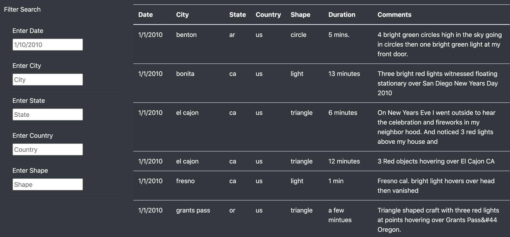
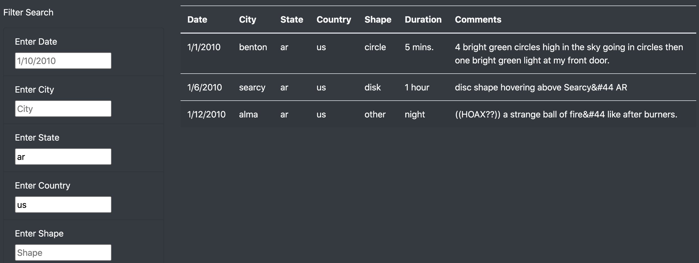

# UFO Sightings

## Overview

The purpose of this project was to build a web page to allow users to examine data on UFO sightings in a visually pleasing interface.

## Results

The data is displayed at the bottom of the web page. The data can be browsed in its entirety, or filtered via the search fields to the left.

The search fields can filter the data on the date of UFO sighting, the city, state, and/or country in which the sighting took place, and the shape of the sighted UFO. Simply enter terms to search for in the appropriate input boxes exactly as the terms appear in the data.

## Summary

While the search function is useful, the current design has several drawbacks, including:

- The search is case-sensitive.
- Searchable terms are not immediately apparent without prior knowledge of the data (e.g. "cigar", "teardrop", or "chevron" for shape).
- Since the data is displayed in one long table, browsing the data can become unwieldy as its size scales.

Possible features for further development include:

- The ability to sort data by particuar fields.
- Organizing data into pages.
- Changing certain search filters from text input boxes to lists of unique terms with checkboxes.
